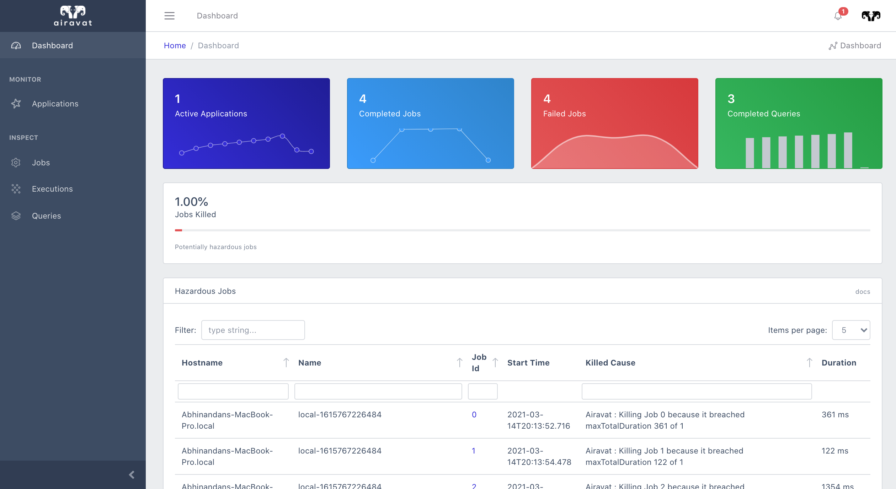

# Airavat
[](https://github.com/alivcor/airavat)
[](https://travis-ci.org/alivcor/airavat)

<p align="center">

</p>

Airavat is a metric interceptor and a job watchdog for Spark Applications. It also features an interactive UI which shows all Spark Applications running, jobs and SQL Queries along with their metrics.




<a href="https://github.com/alivcor/airavat">:octocat: Link to GitHub Repo</a>

## Features

- :heavy_check_mark: Super-fast integration, just add the jar and you're good to go
- :heavy_check_mark: Monitor Jobs, Queries and Executions
- :heavy_check_mark: Collect Job Metrics such as Disk Spill, Shuffle Read Data, Result Size etc.
- :heavy_check_mark: Collect Query Plans and view them on the UI
- :heavy_check_mark: Set Limits / Thresholds for maximum shuffle / maximum result size / duration of a job.
- :heavy_check_mark: Aggregate Data across all spark applications
- :heavy_check_mark: Works with all spark application modes - local, yarn-client, cluster etc.


### Prerequisites

 - Spark 2.3.0 + 
 - Scala / sbt to compile and build the jar
 - ReactJS, Node/NPM and dependencies for the frontend/UI
 - FastAPI, SQLAlchemy for the server.

### Installation

#### 1. Clone the project

```bash
      git clone https://github.com/alivcor/airavat.git
```

#### 2. Build the jar

```bash
      sbt clean package publishLocal
```

#### 3. Test Run

```bash
      sbt run
```

#### 4. Add The Jar to your Spark Application

Linux/MacOS

```bash
    --conf "spark.extraListeners=com.iresium.airavat.AiravatJobListener"
    --conf "spark.airavat.collectJobMetrics=true"
    --conf "spark.airavat.collectQueryMetrics=true"
    --conf "spark.airavat.collectQueryPlan=true"
    --conf "spark.airavat.collectJobMetrics=true"
    --jars /path/to/airavat-0.1.jar
```

Scala Application

```scala
val spark = SparkSession
        .builder()
        .master("local")
        .appName("My Spark Application")
        .config("spark.extraListeners", "com.iresium.airavat.AiravatJobListener")
        .config("spark.airavat.collectJobMetrics", "true")
        .config("spark.airavat.collectQueryMetrics", "true")
        .config("spark.airavat.collectQueryPlan", "true")
        .getOrCreate()
```


### Setting up Backend Server


#### 1. Install Dependencies

```bash
      cd server
      pip install -r requirements.txt
```

#### 2. Start the server

```bash
      uvicorn main:app
```

You can also run it with nohup as a daemon process `nohup main:app >> airavat_server.log &`

### Setting up the Frontend Server


#### 1. Install Dependencies

```bash
      cd ui
      npm install
```

#### 2. Start the server

```bash
      npm start
```

### Building Airavat for Spark 3.0+

```
1. Change the `sparkVersion` to desired spark version
2. Build the sbt package again.
3. Make sure to update the jars.
```


## Contributing

Looking for contributors ! You are welcome to raise issues / send a pull-request.


## Authors

* **Abhinandan Dubey** - *@alivcor*

## License

This project is licensed under the MIT License - see the [LICENSE.md](LICENSE.md) file for details

[](https://github.com/alivcor/airavat/#)

<a href="https://www.buymeacoffee.com/abhinandandubey" target="_blank"></a>